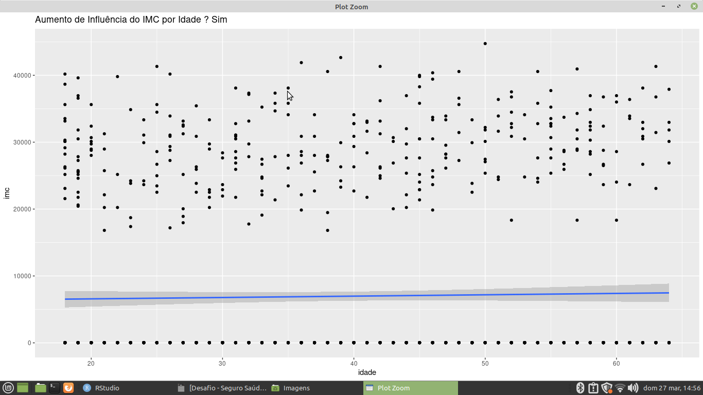
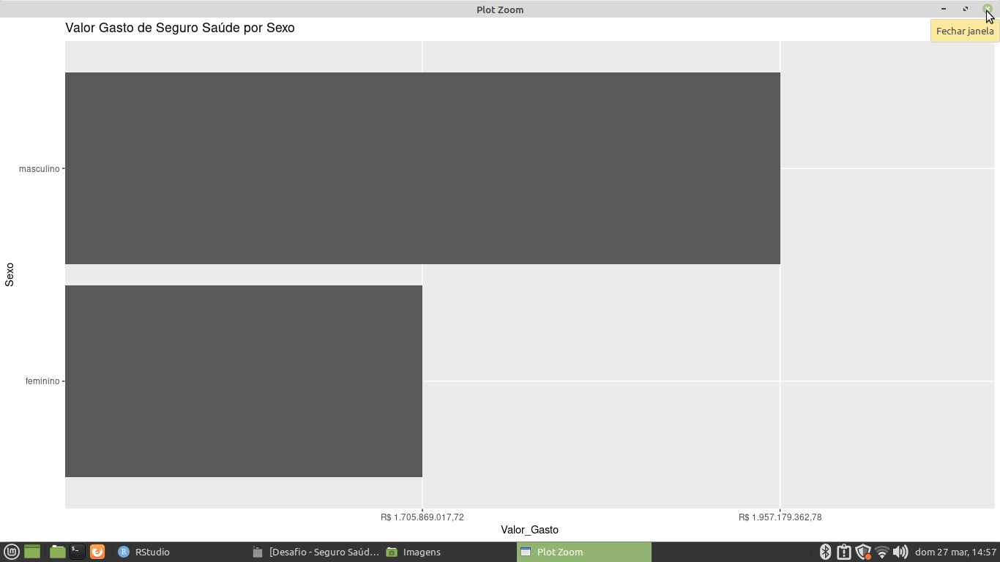
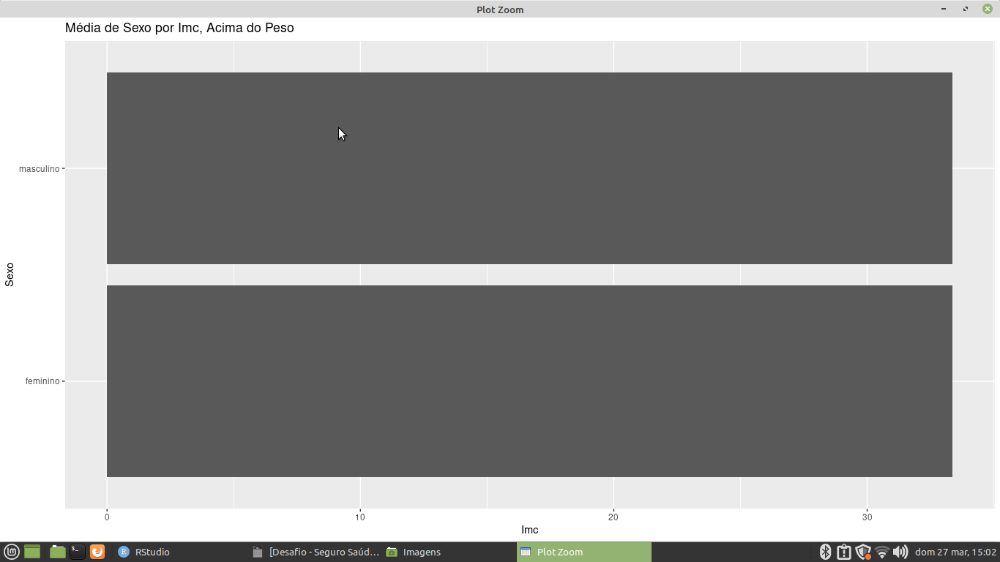
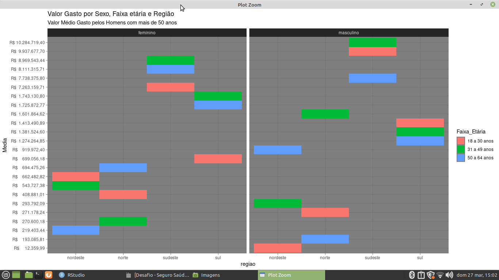

## Sobre o Projeto

** Seguro Saúde ** 

* uma operadora de plano de saúde que atende em quatro regiões do Brasil.

* Os dados disponíveis correspondem ao ano anterior dos usuários da
operadora e possuem as colunas: idade, sexo, imc (índice de massa corpórea), se é
criança, se é fumante, a região do usuário e o valor de seguro saúde de cada
usuário

## Tarefas para a planilhia da Jucepe

** O gasto total da operadora ** 
   
** A idade média dos usuários da operadora ** 

** O gasto médio por região ** 

** A faixa etária que possui maior gasto com seguro saúde por região **

** O aumento da idade que influencia no imc **

** maior gasto de homens e mulheres ** 

** imc abaixo ou acima da média **

** Maior ou menor média de Valor Seguro Saúde por Sexo ** 

## Passos para a tarefa 

    1 - Importando o caminho do disco para a Linguagem 
    2 - Lendo o caminho do disco 
    3 - Instalando as bibliotecas para gerar gráficos e Agrupamento de dados
    4 - Lendo as Bibliotecas para gerar gráficos e Agrupamento de dados
    5 - Agrupando das colunas, para realizar calculos básicos de Soma e Média do Seguro Saúde 
    6 - Usando um pacote de biblioteca Esquisse para gerar gráficos dinâmicos e fazer Storytelling 
    8 - Plotando Gráficos para gerar as análises mais prévias dos dados.
    9 - Conversão do Valor Seguro Saúde para Moeda 
    
## Tecnologias Utilizadas 

** O projeto foi desenvolvido com as seguintes tecnologia ** 

- [R](https://www.r-project.org/)

## Pacotes Utilizados 

** Pacotes para a sessão de agrupamentos e consultas de colunas e geração de gráficos 

- [tidyr](https://tidyr.tidyverse.org/)
- [dplyr](https://dplyr.tidyverse.org/)
- [esquisse](https://www.littlemissdata.com/fdf/esquisse)
- [ggplot2](https://ggplot2.tidyverse.org/) 

## Bibliotecas para Geração de Gráficos da Jucepe 

- [geom_bar](https://plotly.com/ggplot2/geom_bar/)
- [geom_boxplot](https://r-graph-gallery.com/boxplot.html)
- [geom_segment](https://ggplot2.tidyverse.org/reference/geom_segment.html)
- [geom_point](https://plotly.com/ggplot2/geom_point/) 
- [geom_tile](https://r-charts.com/correlation/heat-map-ggplot2/)

## Imagens dos Gráficos da Jucepe 

** Aumento de influência do IMC por idade  ** 

** Valor Gasto de Seguro Saúde por Sexo **

** Média de Peso por IMC ** 

** Valor Gasto por Sexo, Faixa etária e região ** 
 

Desenvolvido por Gustavo Henrique de Souza Silva
